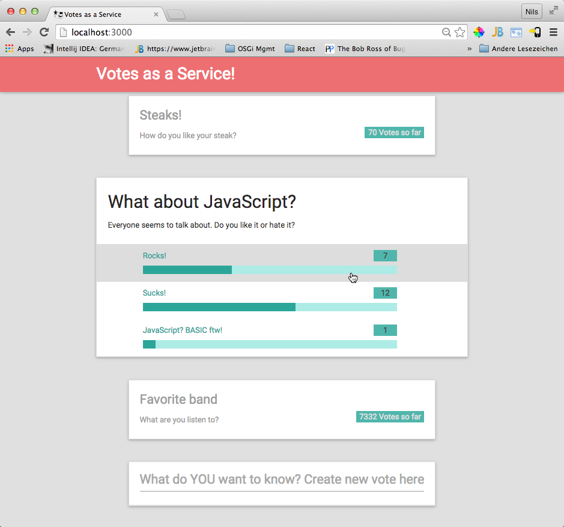

Flux Example "Voting as a service"
==================================

Use Cases
---------
* User gets a list of all votes and a button to create a new vote
* User can open a vote and make a choice
* User can create a new vote

Build, Test and run
-------------------
1. Clone the repository
2. Run `npm install` to install the required server modules
3. Run `bower install` to install the client dependencies
4. Run `run-gulp-es6.sh dist` to transpile js files and run the tests (Note that this shell script is a small wrapper to make gulp run 
the ES6 features correctly)
5. Run `iojs --harmony-classes _dist/server/index.js` to start the server process. The process will run on port 3000.
6. Point your webbrowser to `http://localhost:3000` to run the client

Using MongoDb
-------------
The application comes with two data store implementations: an 'in-memory database' and a MongoDb connector. By default
if you start the application, the in-memory db will be used. To use MongoDb set the configuration `db.type` property in `index.js` to
'mongo'. The application then requires to have `mongod` running on localhost at it's default port (27017).

Technologies and frameworks used
--------------------------------
* iojs
* React and Flux
* Babel for transpiling ES6 code to ES5
* Mocha, Chai and Sinon for testing
* bower for client component management
* npm for server module management
* gulp for build
* (optional) MongoDb for storing the data

